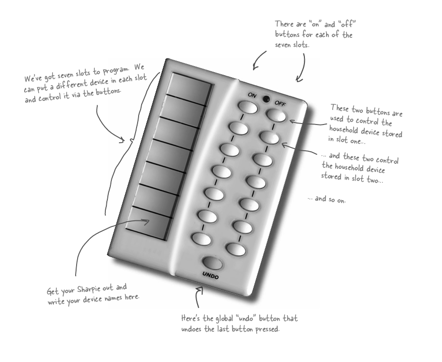
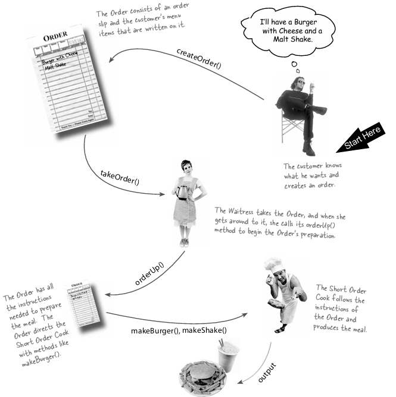

# S - Single Responsibility Principle 
Single Responsibility Principle (SRP)
Definition: The Single Responsibility Principle (SRP) is one of the five SOLID principles of object-oriented design. It states that a class should have only one reason to change, meaning it should have only one responsibility or job.

Purpose: SRP aims to make a class easier to understand, maintain, and modify by ensuring it has a single responsibility. This leads to better cohesion and reduces the impact of changes, as modifications to one responsibility do not affect other responsibilities.


### Example of Not Maintaining SRP
Scenario: Consider a class called `ReportManager` that handles both generating and printing reports.

```java
public class ReportManager {

    public void generateReport(String reportData) {
        System.out.println("Generating report with data: " + reportData);
    }

    public void printReport(String report) {
        System.out.println("Printing report: " + report);
    }

    public static void main(String[] args) {
        ReportManager reportManager = new ReportManager();
        
        String data = "Annual Sales Data";
        reportManager.generateReport(data);
        reportManager.printReport("Report: Annual Sales Data");
    }
}
```
Output
```
Generating report with data: Annual Sales Data
Printing report: Report: Annual Sales Data
```


#### Issues:

* #### Multiple Responsibilities: 
    The ReportManager class handles both report generation and printing. It has two reasons to change: changes in how reports are generated and changes in how they are printed.

* #### Coupling: 
    Changes to the report generation logic might affect the report printing logic and vice versa.


### Example of Maintaining SRP

Scenario: To adhere to the SRP, we can split the ReportManager class into two separate classes: one for generating reports and another for printing them.

1. ReportGenerator Class:
```java
public class ReportGenerator {
    public void generateReport(String reportData) {
        System.out.println("Generating report with data: " + reportData);
    }
}
```
2. ReportPrinter Class:
```java
public class ReportPrinter {
    public void printReport(String report) {
        System.out.println("Printing report: " + report);
    }
}
```

3. Main Class
```java
public class ReportApplication {

    public static void main(String[] args) {
        ReportGenerator reportGenerator = new ReportGenerator();
        ReportPrinter reportPrinter = new ReportPrinter();

        String data = "Annual Sales Data";
        reportGenerator.generateReport(data);
        reportPrinter.printReport("Report: Annual Sales Data");
    }
}
```

Output
```
Generating report with data: Annual Sales Data
Printing report: Report: Annual Sales Data

```

Benefits of Adhering to SRP:

* Focused Responsibilities:
     `ReportGenerator` is solely responsible for generating reports, while `ReportPrinter` handles printing.
* Ease of Maintenance: 
    Changes in the report generation logic do not affect the report printing logic and vice versa.
* Improved Reusability: 
    Each class is easier to understand and can be reused in different contexts without involving unrelated functionalities.

    
By separating concerns into distinct classes, the code adheres to the Single Responsibility Principle, making it more modular, maintainable, and focused.


# O - Open/Closed Principle (OCP)
"Software entities (such as classes, modules, functions, etc.) should be **open for extension** but **closed for modification.**"

**Open for Extension:** You should be able to extend the behavior of a module or class without changing its existing code. 

**Closed for Modification:** Once a class or module has been developed and tested, it should not be altered to add new behavior. Instead, you should be able to add new features by adding new code.

_**Example :**_

Consider a `ShapeCalculator` class that calculates the area and perimeter of different shapes, such as rectangles and circles.

```java
// Class representing a Rectangle
class Rectangle {
    private double width;
    private double height;

    public Rectangle(double width, double height) {
        this.width = width;
        this.height = height;
    }

    public double getWidth() {
        return width;
    }

    public double getHeight() {
        return height;
    }
}

// Class representing a Circle
class Circle {
    private double radius;

    public Circle(double radius) {
        this.radius = radius;
    }

    public double getRadius() {
        return radius;
    }
}

// Class that violates the Open/Closed Principle
public class ShapeCalculator {

    // Method to calculate area of a shape
    public double calculateArea(Object shape) {
        if (shape instanceof Rectangle) {
            Rectangle rectangle = (Rectangle) shape;
            return rectangle.getWidth() * rectangle.getHeight();
        } else if (shape instanceof Circle) {
            Circle circle = (Circle) shape;
            return Math.PI * circle.getRadius() * circle.getRadius();
        }
        return 0;
    }

    // Method to calculate perimeter of a shape
    public double calculatePerimeter(Object shape) {
        if (shape instanceof Rectangle) {
            Rectangle rectangle = (Rectangle) shape;
            return 2 * (rectangle.getWidth() + rectangle.getHeight());
        } else if (shape instanceof Circle) {
            Circle circle = (Circle) shape;
            return 2 * Math.PI * circle.getRadius();
        }
        return 0;
    }

    // Main method to run the program
    public static void main(String[] args) {
        ShapeCalculator calculator = new ShapeCalculator();

        Rectangle rectangle = new Rectangle(5, 7);
        Circle circle = new Circle(3);

        System.out.println("Rectangle Area: " + calculator.calculateArea(rectangle));
        System.out.println("Rectangle Perimeter: " + calculator.calculatePerimeter(rectangle));

        System.out.println("Circle Area: " + calculator.calculateArea(circle));
        System.out.println("Circle Perimeter: " + calculator.calculatePerimeter(circle));
    }
}
```

In this design, adding support for a new shape, such as a triangle, would require modifying the existing methods calculateArea and calculatePerimeter. This violates the Open/Closed Principle because the existing code must be changed to introduce new functionality.

_**Solution :**_

To comply with the OCP, we can refactor the code by creating an abstract base class or interface for shapes and then implementing specific shape classes. This way, new shapes can be added without changing the existing code.

```java
// Abstract Shape class
abstract class Shape {
    public abstract double calculateArea();
    public abstract double calculatePerimeter();
}

// Rectangle class
class Rectangle extends Shape {
    private double width;
    private double height;

    public Rectangle(double width, double height) {
        this.width = width;
        this.height = height;
    }

    @Override
    public double calculateArea() {
        return width * height;
    }

    @Override
    public double calculatePerimeter() {
        return 2 * (width + height);
    }
}

// Circle class
class Circle extends Shape {
    private double radius;

    public Circle(double radius) {
        this.radius = radius;
    }

    @Override
    public double calculateArea() {
        return Math.PI * radius * radius;
    }

    @Override
    public double calculatePerimeter() {
        return 2 * Math.PI * radius;
    }
}

// Main class to demonstrate OCP adherence
public class ShapeCalculator {

    public static void main(String[] args) {
        // Creating instances of different shapes
        Shape rectangle = new Rectangle(5, 7);
        Shape circle = new Circle(3);

        // Calculating area and perimeter using polymorphism
        System.out.println("Rectangle Area: " + rectangle.calculateArea());
        System.out.println("Rectangle Perimeter: " + rectangle.calculatePerimeter());

        System.out.println("Circle Area: " + circle.calculateArea());
        System.out.println("Circle Perimeter: " + circle.calculatePerimeter());
    }
}
```


Now If we create new extention such as square we dont have to modify the calculateArea or calculatePerimeter method, extending new class would enough now.


# L-Leskov Substitution Principle (LSP)

"Objects of a superclass should be replaceable with objects of its subclasses without affecting the correctness of the program."


This means if you have a base class and a derived class, you should be able to use instances of the derived class wherever instances of the base class are expected, without breaking the application.

_**Violation :**_

Consider a `Vehicle` base class and two derived classes: `Car` and `Bicycle.`

Without following the LSP, the code might look like this:

```java
// Base class
class Vehicle {
    public void startEngine() {
        // Logic to start engine
        System.out.println("Engine started.");
    }
}

// Derived class Car
class Car extends Vehicle {
    @Override
    public void startEngine() {
        // Car-specific engine start logic
        System.out.println("Car engine started.");
    }
}

// Derived class Bicycle
class Bicycle extends Vehicle {
    @Override
    public void startEngine() {
        // This doesn't make sense for a bicycle
        throw new UnsupportedOperationException("Bicycles do not have engines.");
    }
}

// Main class to demonstrate Liskov violation
public class VehicleTest {

    public static void main(String[] args) {
        Vehicle car = new Car();
        Vehicle bicycle = new Bicycle();

        // Starting engine for a car (this works as expected)
        car.startEngine();

        // Attempting to start engine for a bicycle (this violates LSP)
        try {
            bicycle.startEngine(); // This will throw an exception
        } catch (UnsupportedOperationException e) {
            System.out.println("Error: " + e.getMessage());
        }
    }
}
```

In this example, the *Bicycle* class violates the Liskov Substitution Principle because it provides an implementation for the *startEngine* method that doesn’t apply to bicycles. If you replace a Vehicle instance with a Bicycle instance, it could lead to errors or unexpected behavior since a bicycle doesn’t have an engine.

_**Solution :**_

To adhere to the LSP, we should modify the design so that all subclasses fulfill the contract established by the base class in a meaningful way.

```java
// Base class with a more general method
abstract class Vehicle {
    public abstract void start();
}

// Derived class Car
class Car extends Vehicle {
    @Override
    public void start() {
        // Car-specific start logic
        System.out.println("Car engine started.");
    }
}

// Derived class Bicycle
class Bicycle extends Vehicle {
    @Override
    public void start() {
        // Bicycle-specific start logic
        System.out.println("Bicycle is ready to ride.");
    }
}

// Main class to demonstrate LSP adherence
public class VehicleTest {

    public static void main(String[] args) {
        Vehicle car = new Car();
        Vehicle bicycle = new Bicycle();

        // Starting the car (this works as expected)
        car.start();

        // Starting the bicycle (this also works as expected, maintaining LSP)
        bicycle.start();
    }
}
```


_**Example 02 :**_

_**Violation :**_

You have a base class `Shape` and two derived classes: `Rectangle` and `Square`. You want to calculate the area of shapes using a base class reference. The challenge is to ensure that subclasses adhere to the base class’s expected behavior.

Initial Problem with LSP Violation:
```java
// Base class
class Shape {
    protected double width;
    protected double height;

    public void setWidth(double width) {
        this.width = width;
    }

    public void setHeight(double height) {
        this.height = height;
    }

    public double getArea() {
        return width * height;
    }
}

// Derived class Rectangle
class Rectangle extends Shape {
    // Rectangle-specific behavior (inherits and uses base class methods)
}

// Derived class Square
class Square extends Shape {
    @Override
    public void setWidth(double width) {
        this.width = width;
        this.height = width; // Ensure square properties
    }

    @Override
    public void setHeight(double height) {
        this.height = height;
        this.width = height; // Ensure square properties
    }
}

// Main class
public class ShapeTest {
    public static void main(String[] args) {
        Shape rectangle = new Rectangle();
        Shape square = new Square();

        // Set dimensions and calculate area
        rectangle.setWidth(4);
        rectangle.setHeight(5);
        System.out.println("Rectangle area: " + rectangle.getArea()); // 20

        square.setWidth(4);
        System.out.println("Square area: " + square.getArea()); // 16

        // The following behavior may be unexpected
        square.setHeight(5); // This also changes width to 5
        System.out.println("Square area after changing height: " + square.getArea()); // 25
    }
}
```

In this design, setting the width or height of a `Square` alters both dimensions to maintain the square property. This can lead to unexpected behavior when substituting `Square` for `Shape.` For example, *changing the height of a `Square` also changes its width*, which might not be desirable in all contexts.

_**Solution :**_

Adhering to LSP with a Proper Design.

To adhere to LSP, refactor the design so that `Rectangle` and `Square` have separate base classes, or use a common interface that doesn’t enforce conflicting constraints. A better approach is to use a common interface or abstract class for `Shape` that doesn’t assume specific constraints.

```java
// Abstract base class for shape
abstract class Shape {
    public abstract double getArea();
}

// Derived class Rectangle
class Rectangle extends Shape {
    private double width;
    private double height;

    public void setWidth(double width) {
        this.width = width;
    }

    public void setHeight(double height) {
        this.height = height;
    }

    @Override
    public double getArea() {
        return width * height;
    }
}

// Derived class Square
class Square extends Shape {
    private double side;

    public void setSide(double side) {
        this.side = side;
    }

    @Override
    public double getArea() {
        return side * side;
    }
}

// Main class
public class ShapeTest {
    public static void main(String[] args) {
        Shape rectangle = new Rectangle();
        Shape square = new Square();

        // Set dimensions and calculate area
        ((Rectangle) rectangle).setWidth(4);
        ((Rectangle) rectangle).setHeight(5);
        System.out.println("Rectangle area: " + rectangle.getArea()); // 20

        ((Square) square).setSide(4);
        System.out.println("Square area: " + square.getArea()); // 16

        // Changing side length of square
        ((Square) square).setSide(5);
        System.out.println("Square area after changing side length: " + square.getArea()); // 25
    }
}
```

*Abstract Base Class:*

The abstract Shape class now only provides an abstract method getArea(), which does not enforce any specific behavior about setting dimensions.

*Separate Implementations:*

`Rectangle` and `Square` now have their own implementations of area calculation, and they handle their respective constraints internally.

`Rectangle` handles width and height independently.

`Square` handles a single side length and calculates the area accordingly.

# I-Interface Segregation Principle (ISP)

No client should be forced to depend on interfaces they don't use.

The Interface Segregation Principle (ISP) is intended to avoid the creation of "fat" or "bloated" interfaces that include methods not relevant to all implementing classes. By decomposing interfaces into smaller, more specialized ones, each client only needs to interact with the methods it actually requires. This approach fosters loose coupling and improves code organization.


*Example of Not Maintaining ISP*

Imagine a system for managing various types of devices in a smart home, such as lights and thermostats.

```java
interface SmartDevice {
    void turnOn();
    void turnOff();
    void setTemperature(int temperature);
}

class Light implements SmartDevice {

    @Override
    public void turnOn() {
        System.out.println("Light turned on.");
    }

    @Override
    public void turnOff() {
        System.out.println("Light turned off.");
    }

    @Override
    public void setTemperature(int temperature) {
        throw new UnsupportedOperationException("Light does not have temperature control.");
    }
}

public class SmartDeviceTest {

    public static void main(String[] args) {
        SmartDevice light = new Light();
        light.turnOn();

        try {
            light.setTemperature(22);
        } catch (UnsupportedOperationException e) {
            System.out.println("Error: " + e.getMessage());
        }
    }
}
```

*Output*
```
Light turned on.
Error: Light does not have temperature control.
```

In this scenario, the `SmartDevice` interface includes a method for setting temperature, which is irrelevant to the `Light` class. As a result, `Light` must implement the `setTemperature` method, even though it doesn't make sense for a light.

*Example of Maintaining ISP*

```java
interface Switchable {
    void turnOn();
    void turnOff();
}

interface TemperatureControllable {
    void setTemperature(int temperature);
}

class Light implements Switchable {

    @Override
    public void turnOn() {
        System.out.println("Light turned on.");
    }

    @Override
    public void turnOff() {
        System.out.println("Light turned off.");
    }
}

class Thermostat implements Switchable, TemperatureControllable {

    @Override
    public void turnOn() {
        System.out.println("Thermostat turned on.");
    }

    @Override
    public void turnOff() {
        System.out.println("Thermostat turned off.");
    }

    @Override
    public void setTemperature(int temperature) {
        System.out.println("Setting thermostat temperature to " + temperature + " degrees.");
    }
}

public class SmartDeviceTest {

    public static void main(String[] args) {
        Switchable light = new Light();
        light.turnOn();

        TemperatureControllable thermostat = new Thermostat();
        thermostat.setTemperature(22);
        thermostat.turnOn();
    }
}
```

In this improved design, the `Switchable` interface includes methods relevant to devices that can be turned on and off, while the `TemperatureControllable` interface is reserved for devices that require temperature control. This way, *each class only needs to implement the methods that are applicable to its functionality*, adhering to the Interface Segregation Principle.

# Dependency Inversion

High-level modules should not depend on low-level modules; both should depend on abstractions.

The Dependency Inversion Principle (DIP) emphasizes that high-level components should not directly depend on low-level components. Instead, both should rely on abstractions, such as interfaces. This principle helps to reduce the coupling between different parts of the system and enhances both flexibility and reusability.

Example of Not Maintaining DIP

Imagine a notification system where a `NotificationService` class is responsible for sending notifications using a specific notification provider, such as SMS.

```java
class SmsProvider {
    public void sendSms(String phoneNumber, String message) {
        System.out.println("Sending SMS to " + phoneNumber + ": " + message);
    }
}

class NotificationService {
    private SmsProvider smsProvider;

    public NotificationService() {
        this.smsProvider = new SmsProvider();
    }

    public void sendNotification(String phoneNumber, String message) {
        smsProvider.sendSms(phoneNumber, message);
    }
}

public class NotificationServiceTest {
    public static void main(String[] args) {
        NotificationService notificationService = new NotificationService();
        notificationService.sendNotification("123-456-7890", "Hello!");
    }
}
```
Output
```
Sending SMS to 123-456-7890: Hello!
```

In this design, the `NotificationService` class directly depends on the `SmsProvider` class, which is a low-level module. This tight coupling means that any change in the SMS provider or the addition of other types of notifications would require changes to the `NotificationService` class.


Example of Maintaining DIP

To adhere to the Dependency Inversion Principle, introduce an abstraction (interface) for notification providers and have the `NotificationService` class depend on this abstraction. Specific implementations of notification providers will then depend on the abstraction.

```java
interface NotificationProvider {
    void sendNotification(String recipient, String message);
}

class SmsProvider implements NotificationProvider {
    @Override
    public void sendNotification(String phoneNumber, String message) {
        System.out.println("Sending SMS to " + phoneNumber + ": " + message);
    }
}

class EmailProvider implements NotificationProvider {
    @Override
    public void sendNotification(String email, String message) {
        System.out.println("Sending email to " + email + ": " + message);
    }
}

class NotificationService {
    private NotificationProvider notificationProvider;

    public NotificationService(NotificationProvider notificationProvider) {
        this.notificationProvider = notificationProvider;
    }

    public void sendNotification(String recipient, String message) {
        notificationProvider.sendNotification(recipient, message);
    }
}

public class NotificationServiceTest {
    public static void main(String[] args) {
        NotificationProvider smsProvider = new SmsProvider();
        NotificationService notificationService = new NotificationService(smsProvider);
        notificationService.sendNotification("123-456-7890", "Hello!");

        NotificationProvider emailProvider = new EmailProvider();
        notificationService = new NotificationService(emailProvider);
        notificationService.sendNotification("example@example.com", "Hello!");
    }
}
```

Output

``` 
Sending SMS to 123-456-7890: Hello!
```


# Design Patterns 

# Command Design Pattern :)

Suppose we have to make another home automation system.




* Each slot represents a different device and can be controlled via buttons.
* Each solt got "on" and "off" buttons
* Also have a undo button

### *BUT INCOMING SOO MANY METHODS ...*


Its not limited to "on" and "off" but some set of vendor classes that are quite diverse, here we’ve got methods like dim(), setTemperature(), setVolume(), setDirection().


*Here's Command Pattern can help us.*

Command Pattern allows you to decouple the requester of an action from the object that actually performs the action.

Here, remote control = requester

#### Question: How can we decouple them?  After all, when we press a button, the remote has to turn on a light?

#### Answer : The remote doesn’t have any idea what the work is, it just has a command object that knows how to talk to the right object to get the work done. So, you see, the remote is decoupled from the light object!


Here's a different example, 



* The cook and waitress is decoupled.
* The waitress just calls the orderup() method
* Orderup() method directs what to do to the cook
* cook follows the instructions

### *Thus, we can solve the problem of diverse methods and in near future we can add as many different classes we want along with their new new methods and we dont have to change anything in the previous codes.*


#### Components to design a command pattern: 


1. Command Interface: Declares a method for executing commands. 

2. Concrete Command Classes:
* Implements the Command interface.
* Defines the binding between a receiver and an action.

3. Receiver: Contains the business logic for performing the actual operations.
4. Invoker: Holds a command and triggers its execution.

5. Client: Sets up the command objects and associates them with the invoker.


The Command design pattern is a behavioral pattern that encapsulates a request as an object, thereby allowing for parameterization of clients with queues, requests, and operations. It also allows for the support of undoable operations. This pattern *decouples the sender and receiver* of a request and allows you to store, queue, or log requests.


Problems the Command Pattern Solves:

### *Decoupling Sender and Receiver:*

The Command pattern decouples the object that invokes the operation from the one that performs it. This allows for flexibility in handling operations, such as queuing, logging, or undoing commands.

### *Parameterization of Requests:*

It allows you to parameterize objects with operations. For example, you can store commands and execute them at a later time or pass them around in a flexible way.

### *Support for Undo/Redo Operations:*

By encapsulating commands in objects, you can easily implement undo/redo functionality since each command object can keep track of its state.

### No burst of subclasses anymore


Example :

Command Interface
The `Command` interface declares a method for executing a command.
```java
public interface Command {
    void execute();
    void undo();
}
```
Receiver
These are the classes that perform the actual actions. For instance, a `Light` class and a `CeilingFan` class:
```java
public class Light {
    public void on() {
        System.out.println("Light is ON");
    }
    
    public void off() {
        System.out.println("Light is OFF");
    }
}

public class CeilingFan {
    public void high() {
        System.out.println("Ceiling Fan is on HIGH");
    }
    
    public void off() {
        System.out.println("Ceiling Fan is OFF");
    }
}

```
Concrete Commands
These classes implement the `Command` interface and invoke the receiver's methods. For example:

```java
public class LightOnCommand implements Command {
    private Light light;
    
    public LightOnCommand(Light light) {
        this.light = light;
    }
    
    public void execute() {
        light.on();
    }
    
    public void undo() {
        light.off();
    }
}

public class CeilingFanHighCommand implements Command {
    private CeilingFan ceilingFan;
    
    public CeilingFanHighCommand(CeilingFan ceilingFan) {
        this.ceilingFan = ceilingFan;
    }
    
    public void execute() {
        ceilingFan.high();
    }
    
    public void undo() {
        ceilingFan.off();
    }
}
```
Invoker
The `RemoteControl` class stores and invokes commands.
```java
public class RemoteControl {
    private Command slot;
    
    public void setCommand(Command command) {
        this.slot = command;
    }
    
    public void pressButton() {
        slot.execute();
    }
    
    public void pressUndo() {
        slot.undo();
    }
}
```
Client
The `Main` class sets up the commands and the invoker.

```java
public class RemoteControlTest {
    public static void main(String[] args) {
        Light livingRoomLight = new Light();
        CeilingFan ceilingFan = new CeilingFan();
        
        Command lightOn = new LightOnCommand(livingRoomLight);
        Command ceilingFanHigh = new CeilingFanHighCommand(ceilingFan);
        
        RemoteControl remote = new RemoteControl();
        
        // Turn the light on
        remote.setCommand(lightOn);
        remote.pressButton();
        
        // Turn the ceiling fan to high
        remote.setCommand(ceilingFanHigh);
        remote.pressButton();
        
        // Undo ceiling fan command
        remote.pressUndo();
        
        // Undo light command
        remote.setCommand(lightOn);
        remote.pressUndo();
    }
}
```
### The paper order serves as a command. It remains in a queue until the chef is ready to serve it. The order contains all the relevant information required to cook the meal. 


Explanation
Command Interface: Defines a method execute that all concrete command classes implement.

Receiver (Light): Contains the methods turnOn and turnOff to perform actual operations.

Concrete Commands:
LightOnCommand encapsulates the action of turning the light on.
LightOffCommand encapsulates the action of turning the light off.

Invoker (RemoteControl):
Has a method setCommand to set the command to be executed.
The pressButton method calls the execute method of the current command.

Client (Main):
Sets up instances of Light, LightOnCommand, and LightOffCommand.
Uses RemoteControl to execute commands to turn the light on and off.


Benefits of the Command Pattern in This Example

Decoupling: The RemoteControl class is decoupled from the Light class and does not need to know the specifics of how the light is turned on or off.

Flexibility: You can easily add new commands (e.g., dimming the light) without changing the RemoteControl class.

Extensibility: New command classes can be created for different actions or devices.

This simple example demonstrates the essence of the Command pattern: encapsulating requests as objects and allowing for flexible and decoupled command handling.


# Adding New Commands

We’ll add a `DimLightCommand` to demonstrate how to extend the functionality.

We can add functionality without modifying the `RemoteControl` class, adhering to the open/closed principle (open for extension, closed for modification).

 Add a Method to the Receiver

 First, update the `Light` class to support dimming functionality.

 ```java
 public class Light {
    public void turnOn() {
        System.out.println("The light is on");
    }

    public void turnOff() {
        System.out.println("The light is off");
    }

    public void dim(int level) {
        System.out.println("The light is dimmed to level " + level);
    }
}
```
 Create New Command

 Implement the `DimLightCommand` that encapsulates the action of dimming the light.

 ```java
 public class DimLightCommand implements Command {
    private Light light;
    private int level; // Dim level

    public DimLightCommand(Light light, int level) {
        this.light = light;
        this.level = level;
    }

    @Override
    public void execute() {
        light.dim(level);
    }
}
```
Use the New Command in the Client

Update the `Main` class to use the new command.

```java
public class Main {
    public static void main(String[] args) {
        // Create the receiver
        Light light = new Light();

        // Create command objects
        Command lightOn = new LightOnCommand(light);
        Command lightOff = new LightOffCommand(light);
        Command lightDim = new DimLightCommand(light, 50); // Dim light to level 50

        // Create the invoker
        RemoteControl remote = new RemoteControl();

        // Turn on the light
        remote.setCommand(lightOn);
        remote.pressButton(); // Output: The light is on

        // Dim the light
        remote.setCommand(lightDim);
        remote.pressButton(); // Output: The light is dimmed to level 50

        // Turn off the light
        remote.setCommand(lightOff);
        remote.pressButton(); // Output: The light is off
    }
}
```

Benefits of This Approach

Open for Extension: we can add new commands like `DimLightCommand` without modifying existing code in the `RemoteControl` class or other command classes.

Closed for Modification: The `RemoteControl` class remains unchanged, adhering to the principle of not modifying existing code while extending functionality.

## When to Use the Command Pattern :
* #### Decoupling Requesters and Handlers:
     When you need to decouple the object that sends a request from the object that processes the request.
* #### Undo/Redo Functionality: 
    When you need to support undo and redo operations for actions performed in the system.

* #### Queueing Requests: 
    When requests need to be queued for later execution or scheduled to run at a specific time.

* #### Dynamic Command Execution: 
    When you need to dynamically change the commands being executed at runtime.


# Decorator  Design Pattern 😃

The Decorator design pattern is a structural pattern that allows you to dynamically add behavior to objects without affecting the behavior of other objects from the same class. This pattern is useful for extending the functionalities of objects in a flexible and reusable way.

### Scenario 


### Problem : Burst of subclasses


### Components of decorator pattern
* #### Component: 
    Defines the interface for objects that can have responsibilities added dynamically. 
* #### Concrete Component: 
    Implements the core functionality of the component.
* #### Decorator: 
    Abstract class or interface that extends `Component` and holds a reference to a `Component` object. It provides an interface for adding functionality. Such as CondimentDecorator().
* #### Concrete Decorators: 
    Extend `Decorator` and add specific functionality to the core component.
* #### Client: 
    Uses the component and decorators to achieve the desired behavior, applying various decorators to extend the component’s functionality.


Example of the Decorator Pattern

Let’s use a standard example involving a simple Coffee class and decorators to add different features like milk, sugar, and whipped cream.

*Component Interface*

Define a common interface for objects that can have functionalities added dynamically.

```java
public interface Coffee {
    double cost();
    String description();
}
```
 *Concrete Component*

Implement the base component.

```java
public class BasicCoffee implements Coffee {
    @Override
    public double cost() {
        return 5.00; // Basic coffee cost
    }

    @Override
    public String description() {
        return "Basic Coffee";
    }
}
```

*Decorator Abstract Class*

Create an abstract decorator class that implements the Coffee interface and has a reference to a Coffee object.

```java
public abstract class CoffeeDecorator implements Coffee {
    protected Coffee coffee;

    public CoffeeDecorator(Coffee coffee) {
        this.coffee = coffee;
    }
}
```

 *Concrete Decorators*

Implement concrete decorators that add functionality.

```java
public class MilkDecorator extends CoffeeDecorator {
    public MilkDecorator(Coffee coffee) {
        super(coffee);
    }

    @Override
    public double cost() {
        return coffee.cost() + 1.00; // Add cost of milk
    }

    @Override
    public String description() {
        return coffee.description() + ", Milk";
    }
}

public class SugarDecorator extends CoffeeDecorator {
    public SugarDecorator(Coffee coffee) {
        super(coffee);
    }

    @Override
    public double cost() {
        return coffee.cost() + 0.50; // Add cost of sugar
    }

    @Override
    public String description() {
        return coffee.description() + ", Sugar";
    }
}

public class WhippedCreamDecorator extends CoffeeDecorator {
    public WhippedCreamDecorator(Coffee coffee) {
        super(coffee);
    }

    @Override
    public double cost() {
        return coffee.cost() + 1.50; // Add cost of whipped cream
    }

    @Override
    public String description() {
        return coffee.description() + ", Whipped Cream";
    }
}
```
*Client Code*
Use the decorators to dynamically add functionalities.

```java
public class Main {
    public static void main(String[] args) {
        Coffee coffee = new BasicCoffee();
        System.out.println(coffee.description() + " $" + coffee.cost());

        Coffee milkCoffee = new MilkDecorator(coffee);
        System.out.println(milkCoffee.description() + " $" + milkCoffee.cost());

        Coffee sugarMilkCoffee = new SugarDecorator(milkCoffee);
        System.out.println(sugarMilkCoffee.description() + " $" + sugarMilkCoffee.cost());

        Coffee fancyCoffee = new WhippedCreamDecorator(sugarMilkCoffee);
        System.out.println(fancyCoffee.description() + " $" + fancyCoffee.cost());
    }
}
```

Problems the Decorator Pattern Solves

### *Adding Functionality Dynamically:*

The Decorator pattern allows you to add new functionality to objects at runtime without modifying their structure or altering existing code.

### *Avoiding Subclass Explosion:*

Instead of creating numerous subclasses to represent different combinations of functionalities, the Decorator pattern lets you combine functionalities through composition. This avoids the problem of having too many subclasses (a subclass explosion).

### *Enhancing Flexibility:*

You can stack decorators to combine various functionalities and modify behavior in a flexible way.

#### *When to Use the Decorator Pattern*

1. When you need to add responsibilities to objects dynamically and flexibly.

2. When subclassing would lead to an explosion of subclasses.

3. When you want to add functionality to individual objects, rather than to entire classes.


# Explanation


Component Interface (`Coffee`): Defines the methods `cost()` and `description()` that both the concrete component and decorators will implement.

Concrete Component (`BasicCoffee`): The base class that provides a basic implementation of `Coffee`.

Decorator Abstract Class (`CoffeeDecorator`): A base class for all decorators that contains a `Coffee` object and delegates method calls to it.

Concrete Decorators (`MilkDecorator`, `SugarDecorator`, `WhippedCreamDecorator`): Extend the functionality of the base `Coffee` by adding their respective features.

Client Code: Demonstrates how you can combine different decorators to dynamically build up the functionality of the Coffee object.

*Benefits of the Decorator Pattern*

*Flexibility:* Allows you to add new functionality at runtime without altering existing code.

*Reusability:* You can mix and match decorators to create different combinations of functionality.

*Open/Closed Principle:* Classes are open for extension (new decorators) but closed for modification.


# Factory Method Design Pattern
Also known as: Virtual Constructor

The Factory Method design pattern is a creational pattern used to define an interface for creating an object, but let subclasses alter the type of objects that will be created. This pattern is particularly useful when a class cannot anticipate the class of objects it must create or when subclasses are expected to provide the implementation.
Scenario : 
Suppose we have a pizza shop


New Types of Pizza 


Adding and removing types of pizzas


Now the Factory Method comes


### We will be creating new objects or changing without touching the actual base class. 


### The Factory Method Pattern defines an interface for creating an object, but *lets subclasses decide which class to instantiate.*  Factory Method lets a class defer instantiation to subclasses


*Structure of the Factory Method Pattern:*

*Product Interface:*

Defines the interface for the objects that the factory method creates.
Example: Soap in the soap example.

*Concrete Products:*

Implements the Product interface and defines specific object types.
Example: LiquidSoap, BarSoap, FoamSoap.

*Creator (Abstract Class or Interface):*

Declares the factory method, which returns a Product object. The Creator class may also include some default implementation or other methods that use the factory method.
Example: SoapFactory.

*Concrete Creators:*

Subclasses of the Creator that implement the factory method to return an instance of a ConcreteProduct.
Example: LiquidSoapFactory, BarSoapFactory, FoamSoapFactory.

Advantage: By utilizing the SimplePizzaFactory, we centralize the pizza creation process and provide a single point of modification when implementing changes.

Moreover, this approach eliminates the need for concrete instantiations in client code, promoting flexibility and maintainability.

*Example: *

Define the `Drink` interface:
```java
// Step 1: 
interface Drink {
    void prepare();
}
```

Create concrete implementations of the `Drink` interface:
```java
// Step 2: Implement concrete classes of the product.
class Coffee implements Drink {
    @Override
    public void prepare() {
        System.out.println("Preparing coffee.");
    }
}

class Tea implements Drink {
    @Override
    public void prepare() {
        System.out.println("Preparing tea.");
    }
}
```

### All the if else conditions and new object will be instantiated only here. We dont have to change anything from the client code or create extra classes.
### Such as we can create new Drink like Juice only instantiating it from DrinkFactory class. 

```java
//Step 3: Define the factory and provide its concrete implementation.
class DrinkFactory {
 public Drink getDrink(String drinkType) {
     if (drinkType == null) {
         return null;
     }
     if (drinkType.equalsIgnoreCase("COFFEE")) {
         return new Coffee();
     } else if (drinkType.equalsIgnoreCase("TEA")) {
         return new Tea();
     }
     return null;
 }
}
```
Client code that uses the Factory Method:

```java
//Demonstrate the Factory Design Pattern.
public class FactoryMethodDrink {
 public static void main(String[] args) {
     DrinkFactory drinkFactory = new DrinkFactory();

     Drink drink1 = drinkFactory.getDrink("COFFEE");
     drink1.prepare();

     Drink drink2 = drinkFactory.getDrink("TEA");
     drink2.prepare();
 }
```

# Problems Factory Method Solves:
### *Encapsulation of Object Creation:*
The pattern encapsulates object creation, *separating the instantiation logic from the client code. This allows the client code to use a factory method without knowing the specific class* that will be instantiated.

### *Decoupling:*
By using a factory method, you can *decouple the client code from the concrete classes* it needs to instantiate. This makes the system more modular and easier to maintain.

### *Flexibility and Extensibility:*
*It allows you to introduce new subclasses without modifying existing code.* *You can extend the system by adding new types of objects and their corresponding factory methods.*

### When to Use :
* ### Unknown Exact Type: 
    When you don’t know beforehand what specific class to instantiate.
* ### Delegation of Creation:
     When a class wants to delegate the responsibility of creating instances to subclasses or a factory method.
* ### Loose Coupling: 
To reduce dependency between client code and concrete implementations.
* ### Code Reusability and Scalability: 
    To facilitate adding new classes without modifying existing code.
* ### Complex Object Creation:
     When the logic for creating objects is complex or varies based on conditions.

